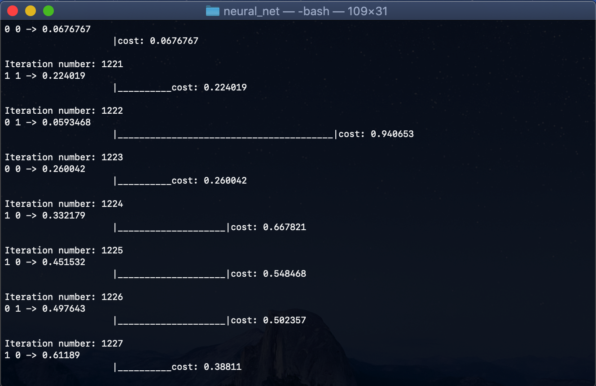

# Artificial Neural Network implementation
This project was created in Vanilla C++ without any additional libraries.

# What it does?
It can be used in various fields. The most common are classification, data processing or function approximation. There is an example of that last one hardcoded in main.cpp file. It makes neural net and learns it to act like a XOR function. Check next iterations of "for loop" to see how cost parameter was changing over time. It indicates how close the output of net was to the actual XOR function result.

## Example
<p align="center" display="block">
  
</p>

## How to run?
```bash
git clone 
cd neural_net
make
./out
```

## Author
**Jakub Żuber** - [zuberol](https://github.com/zuberol)

## License
[MIT](https://choosealicense.com/licenses/mit/)
