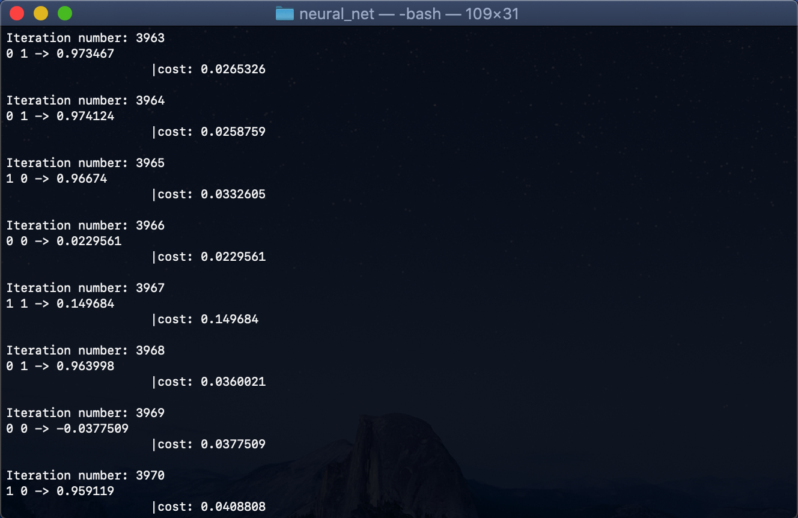

# Neural network implementation
This project was created in Vanilla C++ code without any additional libraries.

# Example


<p align="center">
  
  
</p>
## How to run?
```bash
git clone 
cd neural_net
make
./out
```
## Requirements:
* g++ compiler

## Author
**Jakub Żuber** - [zuberol](https://github.com/zuberol)

## License
This project is free to use or modify.
